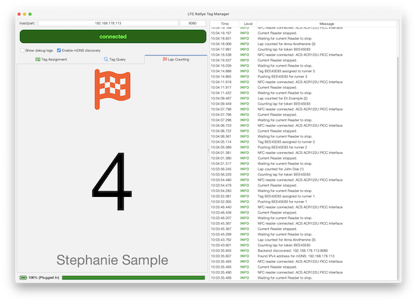

# LTC Rally Tag Manager

**LTC Rally Tag Manager** is a desktop application for configuring and operating NFC/RFID tag readers used in charity running events. It works as a companion to the [LTC Rallye web application](https://github.com/waschmittel/ltc-rallye) to enable real-time lap tracking for sponsor-based running rallies.

[](ddocs/tagmanager.png)

## What is it?

Tag Manager is designed for charity running events where runners complete laps tracked by NFC/RFID technology. This desktop application:

- **Configures NFC tag readers** (tested with ACR122U devices)
- **Assigns RFID tags to runner numbers** for identification
- **Counts laps automatically** when runners pass the reader
- **Communicates with the LTC Rallye web application** to record lap times in real-time
- **Discovers backend servers** automatically via mDNS service discovery
- **Monitors system resources** like battery level on laptops

## Features

- **Real-time Lap Counting**: Automatically detects NFC tags and records laps
- **Tag Assignment**: Map physical RFID tags to runner numbers
- **Tag Query**: Test and verify individual tags work correctly
- **Backend Discovery**: Automatically finds LTC Rallye servers on the local network
- **Connectivity Monitoring**: Visual indicators for reader and server connection status
- **Battery Monitoring**: Track laptop battery level during outdoor events
- **Cross-platform**: Runs on Windows, macOS, and Linux

## How to Use

### Prerequisites

- **Java 25 or higher**
- **NFC smartcard reader** (tested with ACR122U)
- **LTC Rallye web application** running on your network (see [ltc-rallye repository](https://github.com/waschmittel/ltc-rallye))

### Setup

1. **Install NFC Reader Drivers** (see platform-specific instructions below)
2. **Build the Application**:
use the build script (will build a proper installable application for Linux(deb), Windows or macOS):

   ```bash
   ./build.sh      # Linux/macOS
   build.bat       # Windows
   ```

3. **Run the Application**:
   start the installer as built above, alternatively you can run it
   - **from JAR**: `java -jar target/tagmanager.jar`
   - **from Shell Script** (Linux/macOS): `./target/tagmanager.sh`
   - **from IDE**: Run the `TagManager` main class

### Using the Application

The application has three main tabs:

#### 1. Lap Counting Tab

This is the main operational mode for counting laps during the event:

- Connect your NFC reader
- The application will auto-discover the LTC Rallye backend server
- When a runner with an assigned tag passes the reader, their lap is automatically recorded
- View real-time log of lap recordings
- Monitor connectivity status via indicators

#### 2. Tag Assignment Tab

Use this before the event to map tags to runners:

- Enter the runner number in the text field
- Scan an NFC tag with the reader
- Click "Assign Tag" to associate the tag with that runner number
- The assignment is sent to the backend server and stored in the database

#### 3. Tag Query Tab

Test individual tags to verify they work:

- Place a tag on the reader
- Click "Query Tag"
- View the tag's unique identifier (UID)
- Useful for troubleshooting reader issues or verifying tag assignments

### Backend Configuration

The application can discover backend servers in two ways:

1. **Automatic (mDNS)**: The application automatically discovers LTC Rallye servers advertising on the local network via mDNS service discovery
2. **Manual**: Enter the hostname/IP and port of your backend server in the Settings panel if auto-discovery doesn't work

### System Monitoring

- **Connectivity**: Green indicator shows reader is connected; blue indicator shows backend connection
- **Battery**: Shows remaining battery percentage on laptops (useful for portable setups at outdoor events)

## Technology Stack

- **Java 25** with Swing for the desktop UI
- **FlatLaf** for modern look and feel
- **PC/SC** (via `javax.smartcardio`) for NFC reader communication
- **Avaje HTTP Client** for REST API communication with backend
- **jmDNS** for automatic backend server discovery
- **Logback** for logging

## Building

The project uses Maven and produces:

- **tagmanager.jar**: Standalone executable JAR (shaded with all dependencies)
- **tagmanager.sh**: Shell script with embedded JAR for Linux/macOS

Tested with ACR122U readers.

## Linux

On Ubuntu and derivatives, follow the instructions from

<https://www.reddit.com/r/nfctools/comments/11l8s00/acr122u_in_linux/>

which refers to

<https://www.jamesridgway.co.uk/install-acr122u-drivers-on-linux-mint-and-kubuntu/>

In case the thread disappears, here are the basics:

1. Blacklist the pn533 and nfc modules: `printf 'blacklist pn533\nblacklist pn533_usb\nblacklist nfc\n' | sudo tee /etc/modprobe.d/blacklist-pn533.conf`
2. `sudo apt install libacsccid1 pcsc-tools pcscd`
3. Ensure the pscsd.socket is enabled: `sudo systemctl enable --now pcscd.socket`
